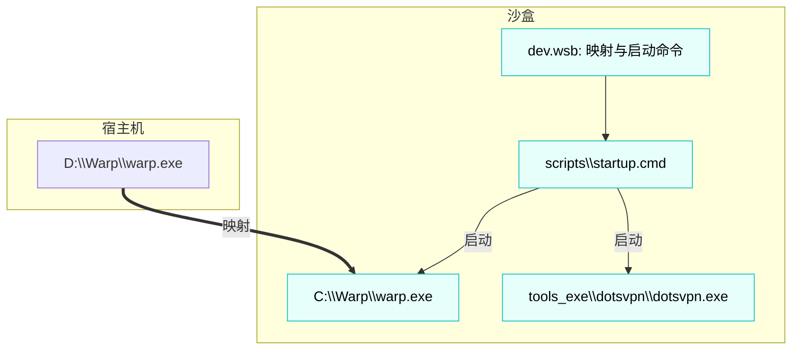

# Windows 沙盒软件配置说明书

## 📋 概述

本说明书帮助你轻松管理 Windows 沙盒中的软件自启动配置，包括添加新软件、禁用现有
软件等操作。

## 🗂️ 文件结构

```
Sandbox/
├── dev.wsb                    # 沙盒配置文件
├── scripts/
│   └── startup.cmd           # 自启动脚本
└── 沙盒软件配置说明书.md      # 本说明书
```

## ⚙️ 当前配置的软件

### 一、⚙️ 已配置的软件列表：

1. **Chrome** - 谷歌浏览器

   - 主机路径：`C:\Chrome\chrome.exe`
   - 沙盒路径：`C:\Chrome\chrome.exe`
   - 状态：❌ 已禁用（注释）

2. **VS Code** - 代码编辑器

   - 主机路径：`E:\Microsoft VS Code\Code.exe`
   - 沙盒路径：`C:\VSCode\Code.exe`
   - 状态：❌ 已禁用（注释）

3. **Warp** - 网络工具

   - 主机路径：`D:\Warp\warp.exe`
   - 沙盒路径：`C:\Warp\warp.exe`
   - 状态：✅ 当前启用

4. **dotsvpn** - VPN 工具
   - 主机路径：`%USERPROFILE%\Desktop\Sandbox\tools_exe\dotsvpn\dotsvpn.exe`
   - 沙盒路径：`%USERPROFILE%\Desktop\Sandbox\tools_exe\dotsvpn\dotsvpn.exe`
   - 状态：状态：❌ 已禁用（注释）

## 二、♻️ 添加新软件启动

## ⚙️ 2.1 软件架构图



## 🌟 2.2 新增一个自启动 exe（最少步骤）

1. 沙盒内访问不到主机安装目录需要在 `dev.wsb` 添加映射例如想在沙盒里启动
   D:\App\App.exe，但沙盒里没有这个路径,只有 C 盘才能访问，需要映射

```xml
<MappedFolder>
  <HostFolder>D:\\YourApp</HostFolder>
  <SandboxFolder>C:\\YourApp</SandboxFolder>
  <ReadOnly>true</ReadOnly>
</MappedFolder>
```

2. 在 `scripts/startup.cmd` 添加启动块：

```batch
REM ===== 启动 YourApp =====
echo 正在启动 YourApp...
set APP_DIR=C:\\YourApp
set APP_EXE=%APP_DIR%\\YourApp.exe
if exist "%APP_EXE%" (
    pushd "%APP_DIR%"
    start "" "%APP_EXE%" {可选参数}
    popd
) else (
    echo 未找到 %APP_EXE%
)
timeout /t 2 /nobreak >nul

```

- 或者使用新建一个 tools_exe 目录,将软件包放在文件里，并使
  用`%USERPROFILE%\Desktop\Sandbox\tools_exe\YourApp\YourApp.exe`启动

```batch
REM ===== 启动 YourApp =====
echo 正在启动 YourApp...
set APP_DIR=%USERPROFILE%\\Desktop\\Sandbox\\tools_exe\\YourApp
set APP_EXE=%APP_DIR%\\YourApp.exe
if exist "%APP_EXE%" (
    pushd "%APP_DIR%"
    start "" "%APP_EXE%" {可选参数}
    popd
) else (
    echo 未找到 %APP_EXE%
)
timeout /t 2 /nobreak >nul
```
